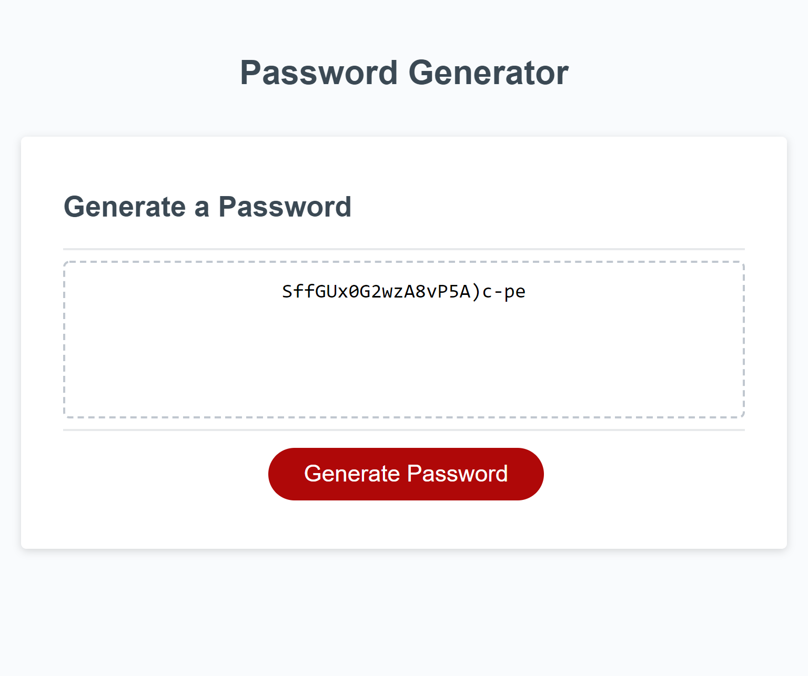

# Password Generator

### Overview
Utilizing the already given HTML, CSS and JS files, make a random password generator that features password length, options to include or exclude uppercase, lowercase alphabet, number and special character using JavaScript.

### Implementation
* Created prompts for user selection.
* Error handling for user prompt and also able to parseInt.
* Used charset as the source for alphabet, numbers and special characters.
* Functions to pass in the variables from the charset source.
* If conditions depending on the user's choice.
* For loop to generate the password.

[Password Generator Webpage Link](https://kaidong-chr.github.io/HW3_Password_Generator/)

### Screenshots
Password length result at length of 22 with all options selected.
 
At 992px

 
 
At 768px

 
 
At 400px

 

### Installation

Prefered application and version controlled system.
* Visual Studio Code - https://code.visualstudio.com/download
* Git - https://git-scm.com/downloads

### Contributing

To contribute clone from the repo.
You can also fork or download from the repo, if you prefer to view or edit this in your own space.

### Credits

* Trilogy Education Services
* W3Schools
* stackoverflow
* stackexchange

### License

Copyright © 2020 Kai Dong